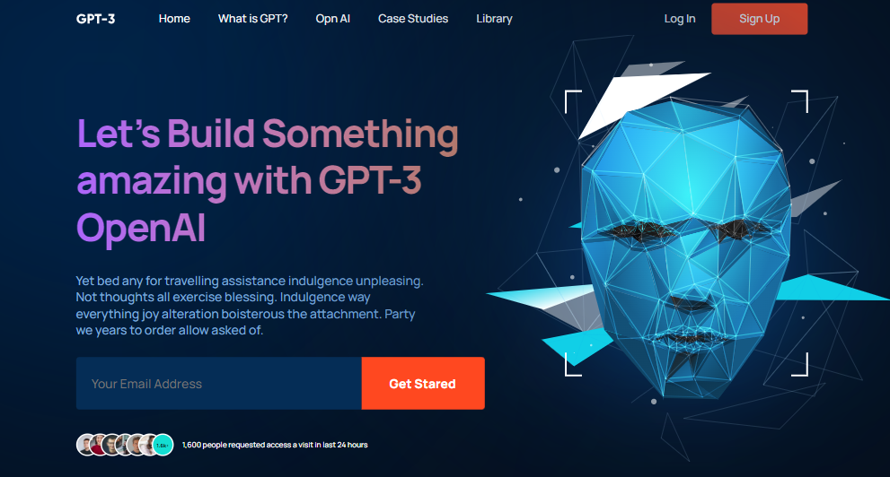

# GPT-3 Landing Page

This is a responsive web page created from a Figma design using HTML, SASS, and Gulp. It serves as a landing page for GPT-3, showcasing its features and capabilities.

## Features:

- Responsive design for various screen sizes.
- Utilizes SASS for modular and maintainable styles.
- Gulp task automation for development and build processes.

### Figma Design:

[https://www.figma.com/file/lz9lLpFHMxHm2odnwM3R0z/gpt3?mode=dev](https://www.figma.com/file/lz9lLpFHMxHm2odnwM3R0z/gpt3?mode=dev)

### Demo:

[https://ronaldodev03.github.io/GPT3-sass-gulp/](https://ronaldodev03.github.io/GPT3-sass-gulp/)
